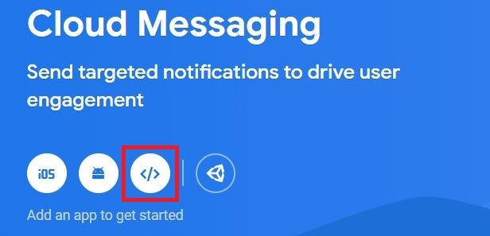
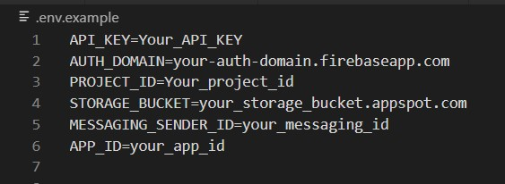
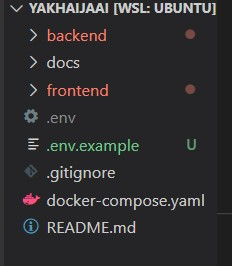
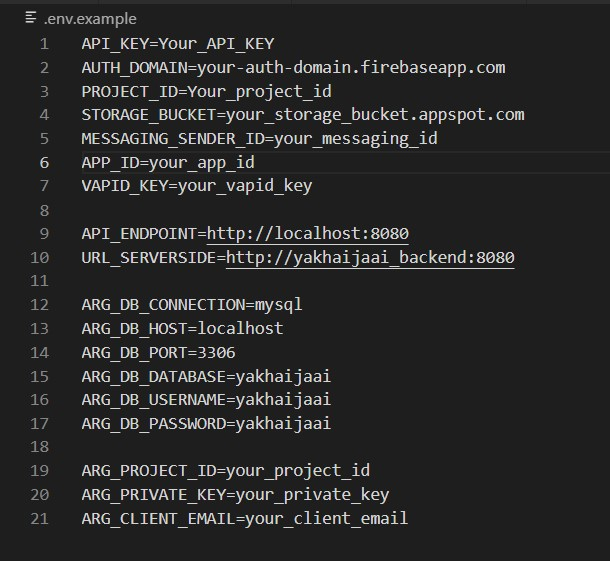
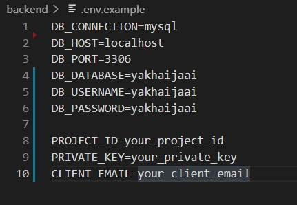
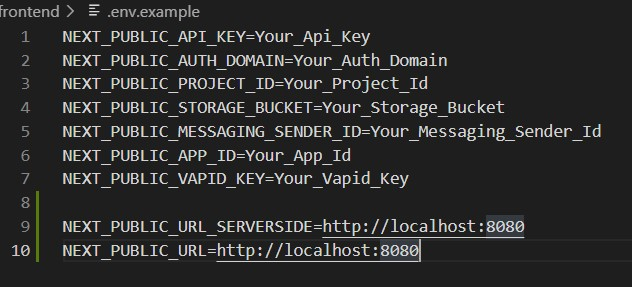
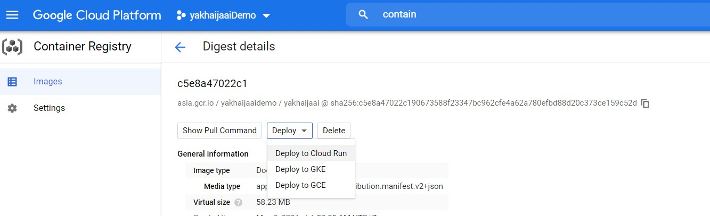

# Prerequisite
Before running our project in any method, the following steps must be done :

1. Download our project on : https://github.com/EaEarth/YakHaiJaai
   Or clone our project on main branch using :
   https://github.com/EaEarth/YakHaiJaai.git

2. Sign in to firebase and add new project

3. In authentication tab, set up sign-in method by enable email/password sign-in method (Email link (passwordless sign-in) is not required)

4. In cloud messaging tab, add an app named “yakhaijaai”(or anything else, this name is not significant for running the project). Configuration information might appear, these information will be used later.


<br/>
##### Figure 1: Add an web app to firebase project
<br/>

5. Under cloud messaging tab in project settings, under Web configuration topic, generate new key pair which will be used later.

6. Under service accounts tab in project settings, in Firebase Admin SDK, generate new private key. you will get a json file which will be used later.

7. In /frontend/public/firebase-messaging-sw.js, replace firebaseConfig with your configuration information (can be found under general tab in firebase project setting)

# Running locally using docker

1. Create a .env file at the root of the project and add configuration information (can be found under general tab in firebase project setting) according to .env.example which can be found in the project's root. You should have .env which looks like this


<br/>
##### Figure 2: .env file example
<br/>
with this folder structure


<br/>
##### Figure 3: Folder structure example
<br/>

2. Under the Cloud Messaging tab in firebase project settings, copy the public key pair and add it to the .env file in a form of : 
`VAPID_KEY=<Key pair>`

3. In the json file which is obtained when generating new private key, copy project_id, private_key and client_email to the .env file in form of :
```
ARG_PROJECT_ID=<project_id> 
ARG_PRIVATE_KEY=<private_key>
ARG_CLIENT_EMAIL=<client_email>
```

4. Add these to .env file :

```
API_ENDPOINT=http://localhost:8080
URL_SERVERSIDE=http://yakhaijaai_backend:8080
ARG_DB_CONNECTION=mysql
ARG_DB_HOST=localhost
ARG_DB_PORT=3306
ARG_DB_DATABASE=yakhaijaai
ARG_DB_USERNAME=yakhaijaai
ARG_DB_PASSWORD=yakhaijaai
```

.env file now should look like this :


<br/>
##### Figure 4: .env file example
<br/>

5. Cd to root directory where docker-compose.yaml belong to

6. Run `docker-compose --env-file .env config` (if your .env file is located in another place, replace .env with path to your .env file). After issue the command, your terminal should show content of docker-compose.yaml file with value in .env is assigned to them

7. Run `docker-compose up -d`

8. Our web should be accessible via localhost:3000

# Running locally without docker

1. Create a new mysql database.
2. Flush user privileges e.g.
   `ALTER USER 'root'@'localhost' IDENTIFIED WITH mysql_native_password BY 'password’; flush privileges;`
3. Create .env inside frontend and backend directory. Both directory already have example file of .env named `.env.example`
4. In the json file which is obtained when generating new private key, copy project_id, private_key and client_email to the .env file inside backend directory in form of :
```
ARG_PROJECT_ID=<project_id> 
ARG_PRIVATE_KEY=<private_key> 
ARG_CLIENT_EMAIL=<client_email>
```
5. Add these to .env file inside backend directory:

```
DB_CONNECTION=mysql
DB_HOST= <your database host or using localhost>
DB_PORT=3306
DB_DATABASE=<your database name>
DB_USERNAME=<your mysql username>
DB_PASSWORD=<your user password>
```

.env file inside backend directory now should look like this:


<br/>
##### Figure 5: .env backend example
<br/>

6. In .env file inside frontend directory, add configuration information (can be found under general tab in firebase project setting) according to .env.example which can be found in the frontend directory

7. Under the Cloud Messaging tab in firebase project settings, copy the public key pair and add it to the .env file inside frontend directory in a form of `VAPID_KEY=<Key pair>`.

8. Add these to .env file inside frontend directory:

```
NEXT_PUBLIC_URL_SERVERSIDE=http://localhost:8080
NEXT_PUBLIC_URL=http://localhost:8080
```

.env file inside frontend directory now should look like this:


<br/>
##### Figure 6: .env frontend example
<br/>

9. cd to frontend directory, run `yarn install` to install package. (if yarn is not installed, you can install yarn by running `npm install --global yarn`) 

10. Start the frontend by running `yarn dev`. 

11. cd to backend directory, run `yarn install` to install package. 

12. Start the backend by running `yarn start` 

13. Our web should be accessible via localhost:3000

# Deploy on cloud

1. Create a new project on Google Cloud or using an existing one
2. Enabled Container Registry in project and install Cloud SDK (can follow the step in https://cloud.google.com/container-registry/docs/enable-service#enable)
3. Create an instance in Google Cloud SQL with MySQL database engine and MySQL version 8.0. Create a new database on created instance and edit authorized networks on connections tab in SQL service to let backend connect to the instance (can edit later)
4. cd to backend directory. Build image by running the this command :

```
docker build \
-t <hostname>/<g-cloud project id>/<image name> \
--build-arg ARG_DB_HOST=<cloud sql host> \
--build-arg ARG_DB_PORT=3306 \
--build-arg ARG_DB_DATABASE=<db-name> \
--build-arg ARG_DB_USERNAME=<username> \
--build-arg ARG_DB_PASSWORD=<password \
--build-arg ARG_PROJECT_ID=<firebase project id> \
--build-arg ARG_PRIVATE_KEY="<firebase private key>" \
--build-arg ARG_CLIENT_EMAIL=<firebase client email> .
```

Then issue the following command: `docker push <hostname>/<g-cloud project id>/<image name>`

\*\*\* If pushing failed with unauthorized error, check that current user has Storage Admin permissions or the Owner role. After checking that permissions is sufficient, issue `gcloud auth configure-docker` command to update authentication.
Note: Firebase information in build arg can be found in json file which is obtained when generating new private key (6.1.6).

Note: Hostname specifies location where the image will be stored. Hostname can be “gcr.io”, “asia.gcr.io” etc.
For more information about pushing image :
https://cloud.google.com/container-registry/docs/pushing-and-pulling 

5. In container registry on g-cloud, examine pushed image detail and select deploy to Cloud Run


<br/>
##### Figure 7: Deploy to cloud run menu
<br/>
After deploying successfully, backend url will be provided. This url will be used to connected frontend with the backend. 

6. Pushing the project to repository on github. 

7. Go to vercel and connect to the github repository. Using nextjs as framework, frontend as root directory and node.js version 14.x. To make the deployment, pushing or pull request to main branch might required. 

8. Add these environment variables to vercel project :

```
NEXT_PUBLIC_API_KEY=Your_Api_Key
NEXT_PUBLIC_AUTH_DOMAIN=Your_Auth_Domain
NEXT_PUBLIC_PROJECT_ID=Your_Project_Id
NEXT_PUBLIC_STORAGE_BUCKET=Your_Storage_Bucket
NEXT_PUBLIC_MESSAGING_SENDER_ID=Your_Messaging_Sender_Id
NEXT_PUBLIC_APP_ID=Your_App_Id
NEXT_PUBLIC_VAPID_KEY=Your_Vapid_Key
NEXT_PUBLIC_URL_SERVERSIDE=Your_backend_url
NEXT_PUBLIC_URL=Your_backend_url
```

After defining environment variables, redeploy frontend to make environment variables. To redeploy, under the Deployments tab in your vercel project, select your latest deployment and under the Kebab Menu(3 vertical dots), select redeploy

9. After building successfully, our web should be accessible via url which vercel have provided
